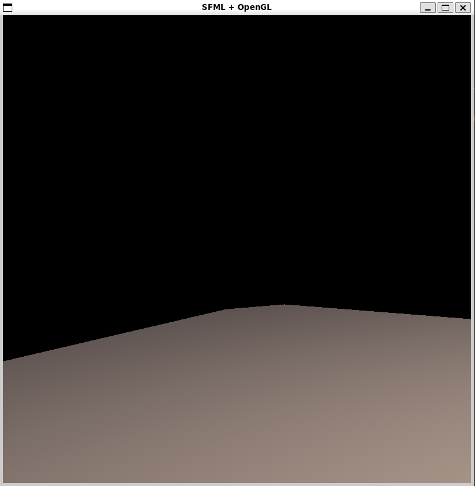
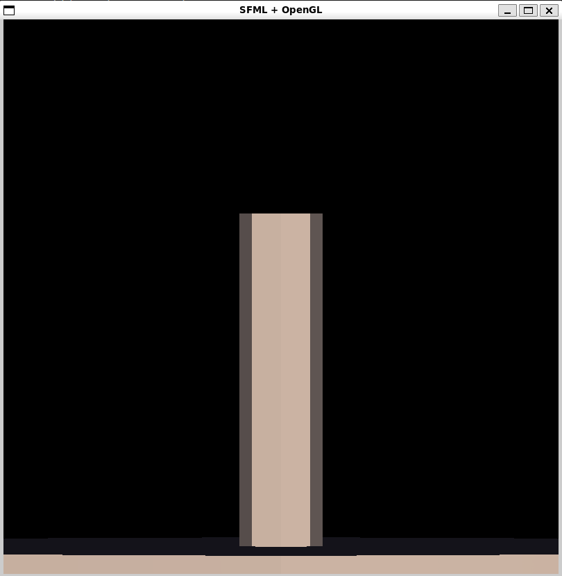
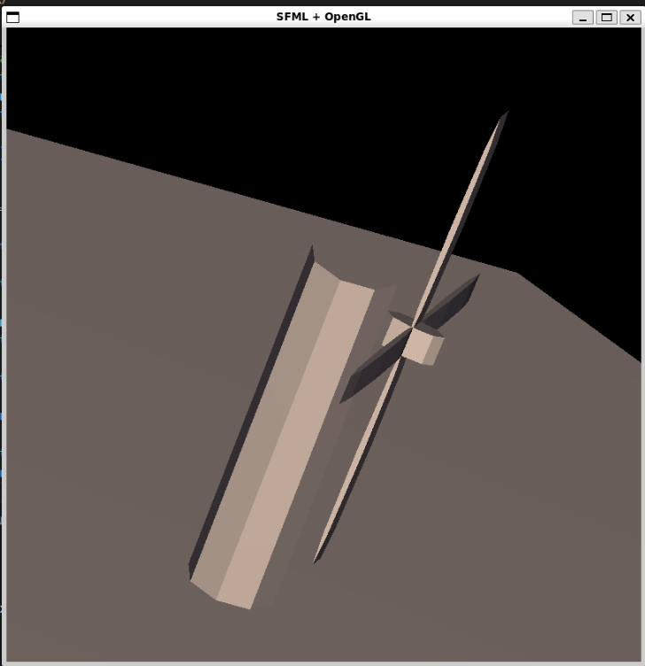
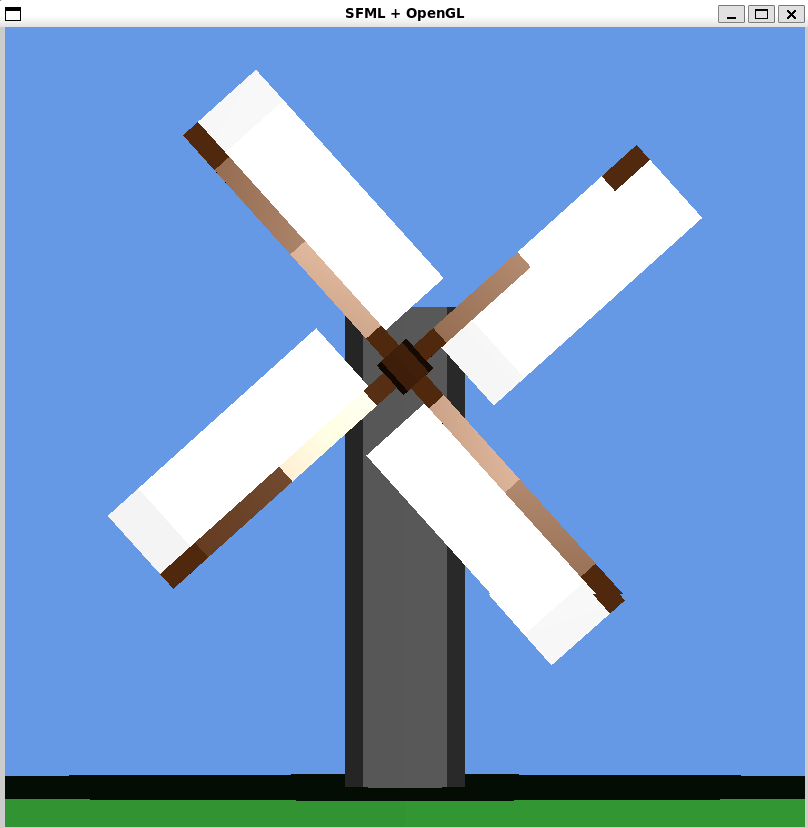
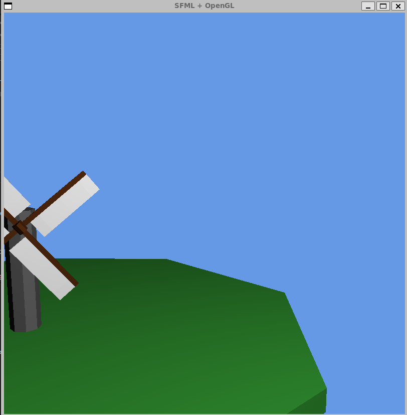
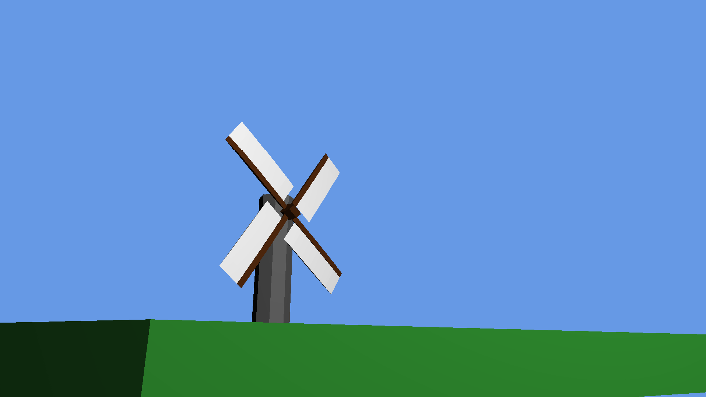
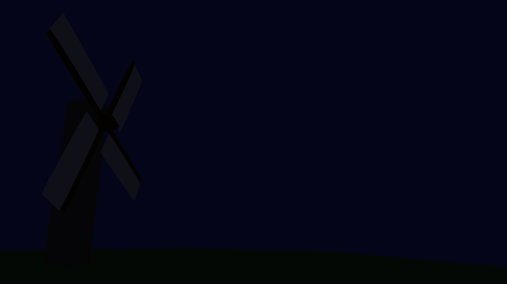
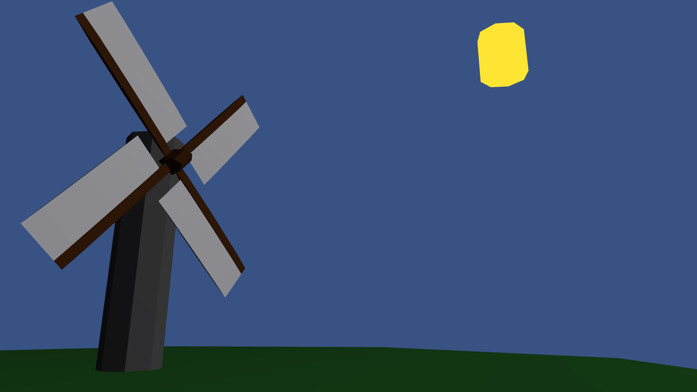

# Relazione del Progetto: Mulino 3D Interattivo
**Autore:** Nicolò Vernetti
**Matricola:** S6382763
**Corso:** Fondamenti di Computer Grafica

# L'Idea

Il progetto consiste nell'esposizione di un mulino che gli utenti potranno esplorare liberamente con una telecamera in prima persone spostandosi in un ambiente 3D.
Può inoltre manipolare il tempo dell'ambiente 3D velocizzandolo, rallentandolo o fermandolo.
Sarà presente anche un ciclo giorno/notte con un "sole" abbozzato che prova a simulare il fattore di passaggio del tempo ciclando intorno all'ambiente 3D.

L'applicazione è renderizzata tramite **OpenGL 4.1** per la pipeline grafica e **SFML 3.0.0** per la gestione della finestra e degli eventi di input. 

L'obiettivo architettonico principale è stato superare il classico approccio procedurale a singolo file, sviluppando un codice modulare, orientato agli oggetti e facilmente manutenibile.

## Tappa 01: Setup Iniziale (Cmake, SFML e Suolo)

Come inizio del progetto ho preso dal laboratorio 7 del corso di FCG una base da cui partire in cui gli ambienti Cmake e SFML sono già stati implementati.

Sono presenti già i file utili .hh nella cartella include: **hotshaders.hh** , **matrices.hh** , **mesh.hh** , **rawmouse.hh** , **trackball.hh**

Già presente è anche il file **cube.off** che ci dà la geometria dei modelli iniziale (a forma di cubo).

Infine il primo cambiamento è nel **main.cc** in cui viene disegnata nella funzione `void draw()` il suolo su cui baserà l'intero disegno virtuale.
Usando la libreria Glad per avere delle *matrici 4x4* (`glm::mat4`), creiamo il pavimento (s) che viene poi traslato in basso rispetto al centro della scena. 
Dopo aver calcolato la matrice di modello finale, viene inviata allo shader insieme alla matrice di vista-proiezione.

## Tappa 02: Struttura Base della Torre del Mulino

Inizia in questa tappa la costruzione della modellazione gerarchica della torre del mulino.

Sono stati aggiunti: un nuovo file oggetto **cylinder.off** per il modello base della torre del mulino (per avere una geometria simil curva); è stata poi aggiunta la definizione del disegno della torre del mulino nella funzione `void draw()`, similare alla creazione precedente del suolo (tramite la composizione di *matrici 4x4*), poggiata poi esattamente sul suolo.

## Tappa 03: Creazione Mozzo e Pale del Mulino

È stato aggiunto il perno di rotazione delle pale del mulino (mozzo), primo pezzo di animazione continua dentro l'ambiente 3D, disegnato sempre nella funzione `void draw()`, similare alla creazione precedente del suolo.

Attraverso l'uso di una gerarchia genitore-figlio per le matrici, sono state poi agganciate le quattro pale al rotore, applicando un offset rotazionale di 90 gradi per ciascuna, rendendo la prima versione del mulino completa.

## Tappa 04: Colori e Luci di Scena

Sono stati aggiunti: le vele delle pale del mulino e i colori della scena: torre del mulino, mozzo, suolo e cielo e anche l'illuminazione base per tutti questi elementi (tramite l'uso della classe *Lights* applicando il modello di illuminazione (Ambient, Diffuse, Specular) ai vari elementi).

## Tappa 05: Controlli iniziali sul Mulino

In questa tappa vengono aggiunti i primi controlli interattivi con l'ambiente 3D con il controllo della velocità delle pale del mulino.

Tramite la cattura degli eventi da tastiera(`sf::Keyboard::isKeyPressed(sf::Keyboard::Scancode::)`) sono stati aggiunti: comandi con tasto *Up* e *Down* per velocizzare e rallentare la velocità delle pale, tasto *Barra Spaziatrice* per fermare il movimento delle pale.

## Tappa 06: 1° Full Refactoring

In questa tappa è stato effettuato un full refactoring del progetto. 

Il cambiamento principale è la divisione delle classi del **main.cc** in diversi file:

**input.cc**: che gestisce le diverse eventi (handle) di Sfml (*SFML Callbacks*)
Con il rispettivo file header **input.hh**

**scene.cc**: che gestisce la classe *Scene*, responsabile dell'aggiornamento delle matrici e delle chiamate di rendering (La principale classe dove viene raffigurata la scena)
Con il rispettivo file header **scene.hh**

**lights.hh**: che gestice la classe *Lights* (dove vengono gestiti i colori e luci della scena)

**camera.hh**: che gestice la classe *Camera* (che definisce il movimento della telecamera, che determina la vista della scena)

**gpumesh.hh**: che gestisce la classe *GPUmesh* (gestione del caricamento delle geometrie sulla memoria video)

**glad.cc**: inclusione del loader ufficiale di OpenGL per il caricamento a runtime dei puntatori alle funzioni della GPU grafica.

Il **main.cc** non è stato eliminato, rimane ancora in utilizzo per il principale main loop per costruire la scena chiamando le funzioni delle altre classi ed è anche rimasta nel main la classe *Setup* che si occupa del gestire il setup iniziale della finestra e di OpenGL.

## Tappa 07: Sviluppo Camera Indipendente (Eliminata trackball)

In questa tappa inizia lo sviluppo della camera indipendente in *first person view*. 

Sono stati aggiunti: movimento con il mouse libero con drag della visuale tenendo tasto sinistro del mouse, sostituita ed eliminata la trackball come metodo di vista.
Sono state attuate modifiche nel file **input.cc** e nel file **camera.hh** principalmente con l'implementazione di `void process_mouse()` per gestire il *pitch* e lo *yaw* della visuale. 

## Tappa 08: Eliminazione del tasto sinistro premuto per muovere la visuale

In questa tappa viene invece fixato il metodo per la gestione del mouse con "*rawmouse*" per riuscire ad avere le migliori prestazioni per il controllo del mouse(e anche altri fix minori), ma principalmente viene rimosso l'obbligo di drag con il mouse sinistro premuto per il movimento della camera.

Viene inoltre cambiato il modo di visione della finestra in full screen.

I principali cambiamenti avvengono in **input.cc** con il cambio della handle che gestisce il movimento del mouse.

## Tappa 09: Movimento libero nell'ambiente 3D

In questa tappa viene aggiunto il movimento tridimensionale con i comandi *W* *A* *S* *D* per muoversi nella quattro direzioni orizzontali, e con *SHIFT* e la *Barra Spaziatrice* per salire e scendere di quota.

I cambiamenti principali avvengono in **camera.hh** dove viene creata `void move()` e `void process_movement()` in cui viene scritta la matematica vettoriale e poi sostituita da `void handle_realtime_input()` in **input.cc** che gestisce il movimento tramite comandi tastiera.

## Tappa 10: 2° Refactoring minore, Aggiunta di Rawmouse

In questa tappa è avvenuto un secondo refactoring minore dove viene effettivamente usata la classe *Rawmouse*, per risolvere i problemi di gestione del mouse.
Viene aggiunto un file **rawmouse.cc** e il suo header **rawmouse.hh** (Successivamente levato perchè non mi ero accorto fosse già presente in *include/*) e vengono modificati i diversi tipi di MouseMoved in Rawmouse per le handle di **input.cc**. 

Oltre ad altri fix minori, viene inoltre viene cambiato il **.gitignore** per la creazione *build-win/* e aggiunto il **windows-toolchain.cmake**, configurando correttamente l'ambiente per permettere una robusta cross-compilazione per ambienti Windows e viene risettato anche OpenGL.

## Tappa 11: Collisioni del prato

Per impedire al giocatore di fluttuare attraverso il pavimento o sprofondare, in questa tappa vengono aggiunte le collisioni per il prato della scena. 

Dopo un prototipo basato su una hitbox quadrata, ho scelto un controllo radiale che ricalca fedelmente la mesh del prato.

Per risolvere i problemi di compenetrazione da sotto la mappa, è stata implementata una logica di *Continuous Collision Detection*: calcolando la posizione precedente del giocatore sull'asse Y, il sistema riconosce se l'utente sta atterrando sul prato o ci sta sbattendo contro dal basso (soffitto), bloccando il vettore di movimento in modo appropriato.

## Tappa 12: Ciclo giorno/notte

Questa tappa ha introdotto un sistema di illuminazione procedurale.
Vengono aggiunti l'illuminazione ambientale globale e il colore del cielo che sono calcolati proceduralmente e viene aggiunto anche un sole fisico.
Tramite `glClearColor` del cielo e la variabile globale dell'intensità ambientale sfumano dinamicamente in base all'altezza (asse Y) della sorgente luminosa, simulando il passaggio dall'alba al buio notturno. 

Usando funzioni trigonometriche, il sole compie un'orbita nel cielo, e lo scorrere del tempo è stato vincolato all'accelerazione meccanica delle pale del mulino, permettendo la manipolazione del tempo della scena con i comandi *M* per fermare e *Up*/*Down* per velocizzare e rallentare il tempo.

I cambiamenti maggiori avvengono in **scene.cc** dove viene disegnato il sole fisico nella funzione `void draw()` e vengono aggiunte le luci distinte a seconda del tempo della scena nella funzione `void update_all()`

### Tappa 13: Correzioni all'Illuminazione e Rifiniture

In questa tappa sono state risolte le anomalie legate all'illuminazione e alla gestione dello stato OpenGL introdotte con il ciclo giorno/notte:

* **Luce globale indipendente dalla telecamera:** rimosse le chiamate a `send_position_relative` in **input.cc** e assegnata la posizione del sole direttamente a `light_direct_pos` in **scene.cc** (`update_all`), risolvendo lo scatto improvviso dell'illuminazione quando la telecamera si muove.
* **Ripristino componente speculare:** ripristinato `material_specular` prima di disegnare il mulino per evitare che restasse azzerato dal rendering del sole nei frame successivi.
* **Logica del rotore:** spostato l'incremento di `angolo_rotore` da `draw()` a `update_all()`, inserendo il reset a 360° per prevenire problemi di precisione numerica.
* **Sole notturno:** modulata la luce ambientale della sfera del sole con `intensita` per spegnerla quando scende sotto l'orizzonte.

# Problemi riscontrati e le soluzioni adottate

## L'ombreggiatura del Sole su se stesso (Self-Shading):

**Problema**: Durante il calcolo del ciclo notturno, la mesh del Sole diventava nera o marrone scuro perché subiva la diminuzione globale dell'illuminazione ambientale applicata al resto della scena. Essendo calcolato con materiali standard, presentava anche antiestetiche ombreggiature sui propri bordi.

**Soluzione**: All'interno di **scene.cc**, poco prima di disegnare il Sole (che è l'ultimo oggetto del render), i coefficienti del materiale diffuse e specular sono stati forzati a 0.0, mentre la luce ambientale locale per la mesh del sole è stata settata al valore massimo. Questo l'ha trasformato in un puro solido "emissivo", che non genera ombre su se stesso e rimane brillante anche nel buio.

## Il "Teletrasporto" durante le collisioni:

**Problema**: Nelle prime versioni della Tappa 11, se l'utente volava in profondità sotto la mappa ed entrava nei limiti X-Z del prato, veniva istantaneamente "teletrasportato" in superficie. Questo accadeva perché la condizione controllava solo l'altezza assoluta camera_pos.y.

**Soluzione**: È stato aggiunto un calcolo sul frame precedente (`vecchia_y = camera_pos.y - up_move`). Il giocatore viene fermato sulla superficie solo se nel frame precedente si trovava sopra il livello del suolo, garantendo libertà di volo esplorativo al di fuori o al di sotto dei confini della mappa.

## Conflitti della cache di CMake (Ninja vs Unix Makefiles):

**Problema**: Durante lo sviluppo, il passaggio tra generatori diversi di CMake in VSCode causava il fallimento del download delle dipendenze (SFML) tramite `FetchContent`, mandando il debugger in `FATAL_ERROR`.

**Soluzione**: È stato necessario rimuovere brutalmente (via terminale con `rm -rf build`) l'intera directory di output per eliminare i file di cache obsoleti annidati dentro *_deps/*, forzando CMake a rigenerare l'albero di dipendenze in modo pulito.

# Risorse esterne utilizzate

**Laboratorio 7 (Corso di FCG)**: Codice sorgente base fornito dal Docente, utilizzato come scaffold per le pipeline di CMake, i file header matematici (**matrices.hh**, **trackball.hh**) e gli shader base.

**Documentazione ufficiale di SFML (v3.0.0)**: Consultata per la corretta gestione degli eventi `sf::Event` e del windowing (`sf::Window`).

**GLM (OpenGL Mathematics)**: Libreria matematica utilizzata per tutte le operazioni su matrici e vettori nello spazio 3D.

**Glad**: Generatore di loader per l'acquisizione dei puntatori delle funzioni OpenGL specifiche della macchina ospite.

**LearnOpenGL (Joey de Vries)**: Riferimento teorico per il funzionamento del modello di illuminazione Phong/Gouraud, il calcolo della matrice LookAt della telecamera e le basi del setup di input FPS.

**Gemini AI**: Per correzioni, dubbi e idee di sviluppo.